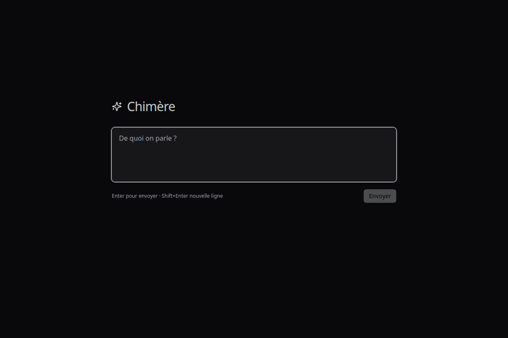
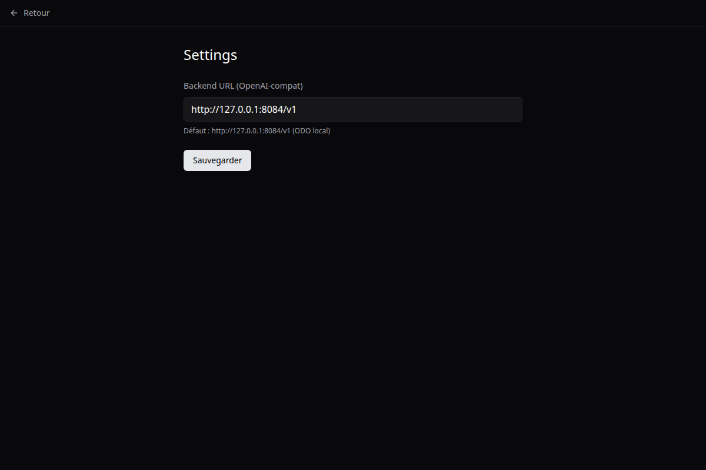

# Chimère Studio

**Local-first AI workspace. One native binary, one local runtime, zero cloud.**

Desktop (Linux / macOS / Windows) via Tauri 2. Android mobile via Compose
Multiplatform (in progress). Works with any OpenAI-compatible backend.
Default target: local ODO at `http://127.0.0.1:8084/v1` routing to
[chimere-server](https://github.com/AIdevsmartdata/chimere).

[](LICENSE)
[](https://tauri.app)
[](https://nextjs.org)
[](#)

## Screenshots

| Home | Settings |
|---|---|
|  |  |

_Home screen uses the "De quoi on parle ?" single-input paradigm — no tutorial,
no onboarding funnel. The Settings page is the only configuration surface._

## The Chimère family

| Repo | Role |
|---|---|
| [`chimere`](https://github.com/AIdevsmartdata/chimere) | Rust inference runtime, 94 tok/s on 16 GB consumer GPU |
| [`chimere-odo`](https://github.com/AIdevsmartdata/chimere-odo) | Python orchestrator — intent routing, deep search, quality gate |
| **`chimere-studio`** (this repo) | Native desktop + mobile UI |
| [`ramp-quant`](https://github.com/AIdevsmartdata/ramp-quant) | RAMP / TQ3 quantisation pipeline |
| Models on HF | <https://huggingface.co/Kevletesteur> |

## Stack

- **Tauri 2** — Rust runtime, native WebView, ~25× lighter than Electron (bundle < 10 MB)
- **Next.js 14** — App Router, static export for Tauri
- **Tailwind CSS v3** — dark mode by default
- **React 18** — UI layer
- **lucide-react** — icon set

## Design principles (explicit choices)

- No marketplace, no "teams", no image generation, no telemetry.
- No onboarding tutorial. The app demonstrates itself by working.
- Voice overlay inspired by Granola's no-bot aesthetic (in progress).
- Memory inspector editable by the user (in progress).
- Settings contains one editable field: the backend URL. That is the design.

## Quick start

### Linux system deps (Ubuntu 24.04+)

```bash
sudo apt install -y libwebkit2gtk-4.1-dev libgtk-3-dev librsvg2-dev \
  libglib2.0-dev libgdk-pixbuf2.0-dev libpango1.0-dev libsoup-3.0-dev \
  libjavascriptcoregtk-4.1-dev libayatana-appindicator3-dev build-essential
```

### Dev / build

```bash
pnpm install
pnpm tauri dev       # dev with hot reload
pnpm tauri build     # release binary
pnpm tauri build --debug   # debug build
```

## Backend config

Backend URL stored in `localStorage` on the WebView side. Editable via
`/settings`.

- **Default**: `http://127.0.0.1:8084/v1` (ODO local)
- **Bypass ODO**: point to `http://127.0.0.1:8081/v1` to hit chimere-server directly
- **External backend**: any OpenAI-compatible endpoint (vLLM, llama.cpp server,
  Anthropic proxy, etc.) works without code changes

## Structure

- `app/` — Next.js 14 App Router pages (`/`, `/chat`, `/settings`)
- `src-tauri/` — Rust binary, Tauri config, icons, capabilities
- `components/` — UI primitives (lucide-based)
- `components/voice/` — VAD + overlay (WIP)

## Roadmap

- [ ] Voice overlay with Silero VAD + Kokoro TTS (local-only)
- [ ] Memory inspector (view + edit Engram tables + Graphiti summaries)
- [ ] Android port via Compose Multiplatform + chimere-core FFI
- [ ] Pyodide artifacts (in-browser Python exec inside the Tauri WebView)
- [ ] React live-preview artifacts

## License

MIT — Kevin Rémondière.

---

**Part of the Chimère local-first stack.**
Built on the philosophy that your AI assistant should run on *your* hardware,
with *your* data, using *your* vocabulary. No teams, no cloud, no telemetry.
